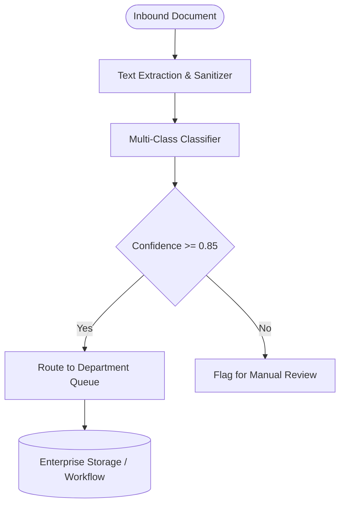

# AI Document Classification System

[](https://python.org)
[](https://fastapi.tiangolo.com)
[](LICENSE)
[]()
[](https://github.com/psf/black)

An automated document classification system designed to analyze incoming enterprise documents, detect intent and document class, and route files to departmental workflows.

---

## Key Features

- **Multi-class**: text classification across Legal, Invoices, HR, Technical, and General
- **Confidence**: scoring and ambiguity rejection thresholds
- **Automated**: departmental queue routing
- **Metadata**: extraction of document language, keywords, and detected entities
- **High-throughput**: REST API for bulk document categorization

---

## Architecture



---

## Tech Stack

| Component | Technology | Purpose |
|---|---|---|
| **Runtime** | Python 3.12 | Core execution environment |
| **API Framework** | FastAPI & Uvicorn | High-performance asynchronous REST endpoints |
| **Data Validation** | Pydantic v2 | Strict schema validation and serialization |
| **Domain Engine** | Dual-Mode (Local + LLM) | Production-ready AI logic with offline test capability |
| **Testing** | Unittest & Pytest | Deterministic automated verification suite |

---

## Project Structure

```text
ai-document-classification/
├── app/
│   ├── __init__.py
│   ├── api.py           # FastAPI routes and server definitions
│   ├── config.py        # Environment variables and application settings
│   ├── models.py        # Pydantic data schemas
│   └── services/        # Core business and AI automation logic
├── tests/
│   ├── __init__.py
│   └── test_doc_classifier.py   # Automated test suite
├── .env.example         # Template for environment configuration
├── .gitignore           # Python and runtime exclusions
├── LICENSE              # MIT License
├── README.md            # Comprehensive project documentation
└── requirements.txt     # Python package dependencies
```

---

## Getting Started

### Prerequisites

- Python 3.10+ (Python 3.12 recommended)
- `pip` package manager

### Installation

1. **Clone the repository:**
   ```bash
   git clone https://github.com/erhatechnologiesai/ai-document-classification.git
   cd ai-document-classification
   ```

2. **Create and activate a virtual environment:**
   ```bash
   python -m venv venv
   # On Windows:
   venv\Scripts\activate
   # On macOS/Linux:
   source venv/bin/activate
   ```

3. **Install dependencies:**
   ```bash
   pip install -r requirements.txt
   ```

4. **Configure environment variables:**
   ```bash
   cp .env.example .env
   # Edit .env with your configuration if running in live mode
   ```

---

## Running the Application

Start the local development server with auto-reload:

```bash
python -m uvicorn app.api:app --reload --host 0.0.0.0 --port 8000
```

Once running, interactive documentation is accessible at:
- **Swagger UI**: [http://127.0.0.1:8000/docs](http://127.0.0.1:8000/docs)
- **ReDoc**: [http://127.0.0.1:8000/redoc](http://127.0.0.1:8000/redoc)

---

## API Endpoints

| Method | Endpoint | Description |
|---|---|---|
| `POST` | `/classify` | Classify document text and determine departmental routing destination |

### Example Request

```bash
curl -X POST http://127.0.0.1:8000/classify -H "Content-Type: application/json" -d '{"text": "Please find attached our employment offer letter and NDA for your review."}'
```

---

## Running Tests

Execute the automated test suite:

```bash
python -m unittest tests/test_doc_classifier.py
```

Or using pytest:

```bash
pytest tests/
```

All test cases are self-contained and run offline without requiring third-party API credentials.

---

## Security & Best Practices

- **Zero Credential Leakage**: API tokens and secrets are loaded exclusively via environment variables and excluded by `.gitignore`.
- **Strict Validation**: All incoming request payloads are strictly validated using Pydantic schemas.
- **Fail-Safe Fallbacks**: Deterministic offline engines guarantee application continuity even during external provider outages.

---

## License

This project is licensed under the terms of the [MIT License](LICENSE).
